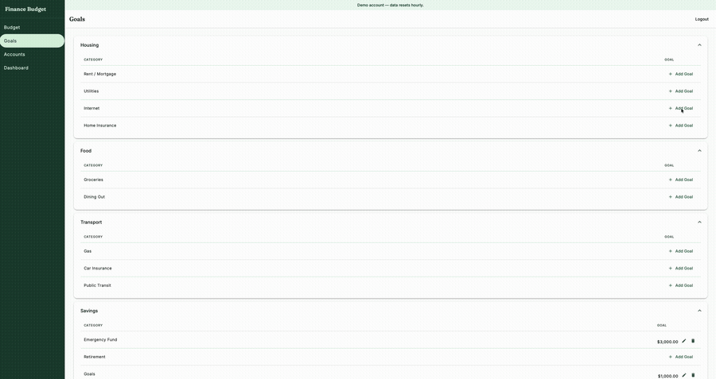

# Finance Budget App

A personal finance and budget tracker. Zero-based budgeting, so every dollar gets assigned to a category before you spend it.

Built as a personal project to replace spreadsheets and learn full-stack Spring Boot + Angular end to end.

---

## Live Demo

**[finance-budget-app-swart.vercel.app](https://finance-budget-app-swart.vercel.app)**

| | |
|---|---|
| Email | `demo@fba.example` |
| Password | `fbaDem0!` |

Shared demo account, seeded with 3 months of sample data. Resets hourly, so don't be surprised if your changes disappear — that's expected. The backend is on Render's free tier and may take a few seconds to wake up on first load.



---

## What it does

- **Accounts** — track checking, savings, credit cards, and cash accounts; balance computed live from transactions
- **Transaction ledger** — paginated and filterable by account and month; inflows/outflows color-coded
- **Budget view** — assign money to categories each month; Ready to Assign header shows unallocated dollars (turns red when overspent)
- **Goal Setting** - set goals for existing categories each month. Goals can be refill up to, or accumulate/set aside another X dollars
- **Category management** — create groups and categories, rename or delete them inline
- **Dashboard** — monthly summary: net worth, income, spending, and a spending-by-category breakdown with progress bars
- **Auth** — Auth0-managed login; Spring Boot validates JWTs as an OAuth2 resource server

---

## Stack

| Layer | Technology | Why |
|---|---|---|
| Backend | Java 21 + Spring Boot 3.x | Familiar, production-grade, strong type system for financial logic |
| Build | Maven | Conventional Java build |
| Database | PostgreSQL (Neon DB) | Free-tier hostable |
| Schema migrations | Flyway | Reproducible, versioned schema — no manual SQL on every setup |
| Frontend | Angular 21 | Component model fits the domain; Angular Material for the UI |
| Auth | Auth0 | Managed auth — not rolling my own session/token handling |
| Deployment | Render (backend), Vercel (frontend) | Free tier, zero ops overhead |

---

## Architecture

```
[Browser] --HTTPS--> [Angular on Vercel]
                             |
                         /api proxy
                             |
                     [Spring Boot on Render] --> [PostgreSQL on Render]
                             |
                         [Auth0 JWT validation]
```

Single server, single database, managed auth. No queues, no cache, no microservices. Designed for one user, deliberately boring.

**Auth: buy, not build.** Auth0 handles signup, login, password resets, and token issuance. Rolling my own auth means owning password hashing, reset-token flows, and session security — a lot of surface area for a personal app where auth isn't the main learning goal. Auth0's free tier covers this scale entirely.

**Stateless JWT** The backend validates a bearer token on every request instead of maintaining session state in a store. This keeps the API server stateless — no session table, no sticky sessions, no shared session cache to provision if it ever scaled beyond one instance. The tradeoff is that revoking a token before it expires isn't instant, which is an acceptable risk for a personal project.

**Render + Vercel** Render and Vercel's free tiers push a `git push` straight to a running URL with managed TLS and restarts. The cost is a cold-start delay after 15 minutes of inactivity on Render's free plan — traded deliberately for zero ops overhead on a project where learning Spring Boot + Angular was the main priority.

---

## Key technical decisions

**Money is `NUMERIC(15,2)`, never `FLOAT`.**
Floating-point arithmetic is wrong for money. `0.1 + 0.2` in IEEE 754 is not `0.3`. All amounts are stored as fixed-point and returned as `BigDecimal` in Java.

**Account balance is computed, never stored.**
Storing a balance creates a sync problem: every transaction mutation has to also update the account row atomically, or you get drift. Instead, `balance = SUM(transactions.amount)` is computed on every read. Correct by construction, no two-phase update needed.

**Flyway for schema migrations.**
A fresh `./mvnw spring-boot:run` applies all migrations automatically. No README step that says "also run this SQL file manually." The schema is versioned alongside the code.

**`month` stored as a `DATE` with a `CHECK` constraint.**
All budget allocations reference a month as `DATE_TRUNC('month', value)` — the first of the month only. A check constraint enforces this at the database level so no application bug can insert a mid-month date.

**No NgRx on the frontend.**
A single `BudgetStateService` with a `BehaviorSubject<string>` holds the selected month. Every component that cares subscribes to it. For a single-user app with no complex shared mutations, adding a full Redux-style store would be over-engineering. Three months in, this is still the right call.

**Optimistic updates for budget allocations.**
When a user edits an allocation, the UI updates instantly and the API call fires in the background. If the server returns an error, the change is reverted. This makes the budget view feel instant without pessimistic locking complexity.

**Standalone Angular components throughout.**
No NgModules. Each component declares its own imports. Easier to read, easier to lazy-load, and the direction Angular is heading anyway.

---

## What I learned

- **Zero-based budgeting is harder to model than it looks.** "Ready to Assign" — the dollars available to budget — is `cumulative_income - total_assigned`. It accumulates across all past months, not just the current one. Getting this calculation right (and keeping it consistent with per-category `available` values) took a few iterations.

- **Spring Data JPA is great until you need aggregate queries.** For the budget view and reports, I needed `SUM` across multiple tables. Rather than forcing that into Spring Data interfaces, I used `EntityManager` with JPQL directly.

- **Angular Material's reactive form model was great** The budget inline-edit fields, dialog forms, and date pickers all share the same `FormGroup` / `FormControl` pattern. Validation, disabled states, and error messages are easy to implement.

- **Deployment can take some time to set up** CORS headers, database connection string format, Auth0 callback URLs, environment variable injection — none of this is hard, but all of it has to be right at the same time. Building the walking skeleton first (empty app, deployed, connected to DB) meant I hit these early rather than at the end, when mental fatigue was inenvitable.
